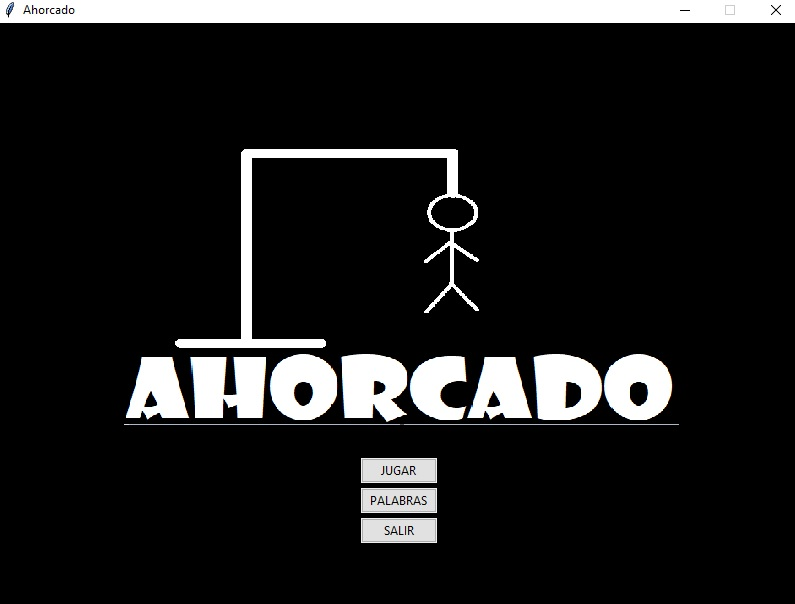
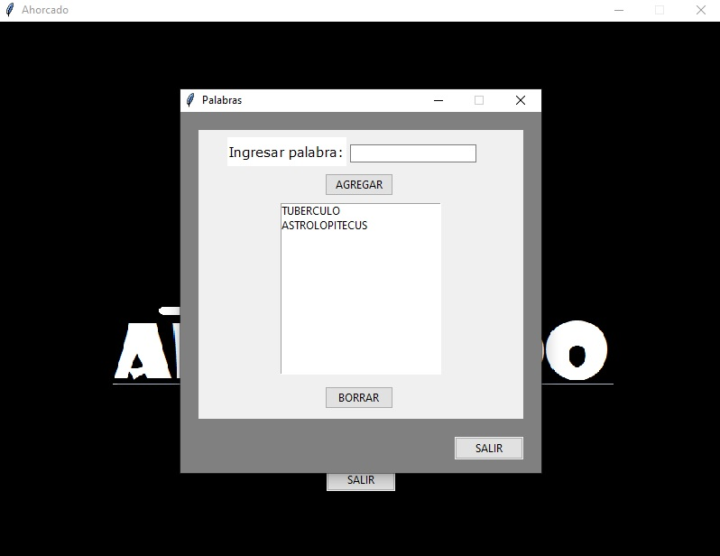
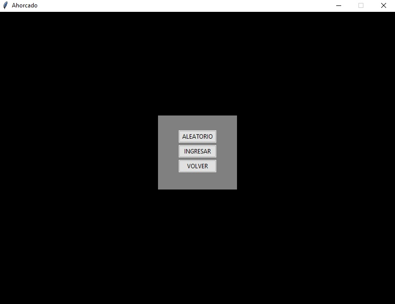
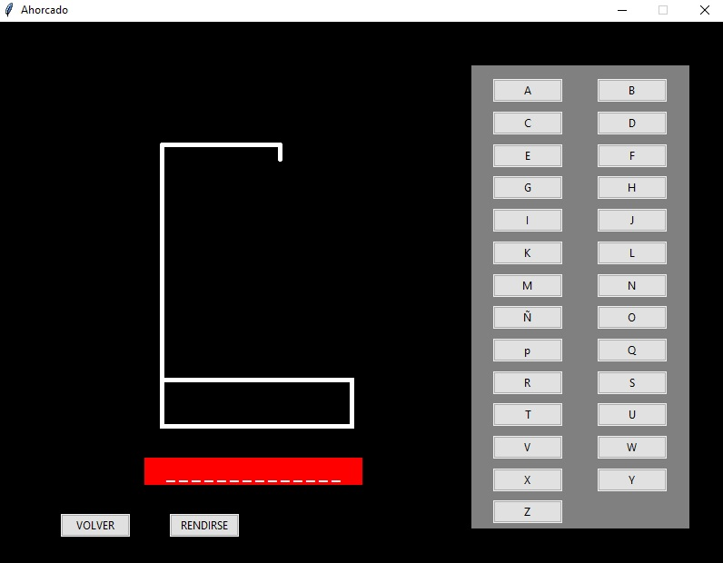

# Ahorcado-con-Interfaz-Grafica

Este proyecto tenía el objetivo de conocer e incorporar herramientas, librerías, de lenguaje Python. Se utilizó el paradigma de programación orientado a objetos, junto con la librería Tkinter y la base de datos integrada a Python, SQLlite.

# Pantalla Principal

En la primer pantalla se encontrara el nombre del juego, y un menú de opciones. “JUGAR”, “PALABRAS” y “SALIR”.

 

# Palabras

En esta opción se podrá modificar la base de datos. Agregar o quitar palabras para el juego.

 

# Jugar

Llevará al usuario hasta una nueva pantalla, donde podrá elegir entre dos modos de ingresar al juego. Por un lado, la opción “ALEATORIO” elegirá al azar una palabra de la base e iniciara el juego. La opción "INGRESAR” permite ingresar una palabra, que se guardara en la base si es una palabra nueva, y luego iniciara el juego.

 

# El Juego

En la pantalla propia del juego habrá una sección con los botones de las letras, la horca y una sección con la palabra a resolver. Existen dos botones, uno para “VOLVER” atrás y otro para “RENDIRSE”.

